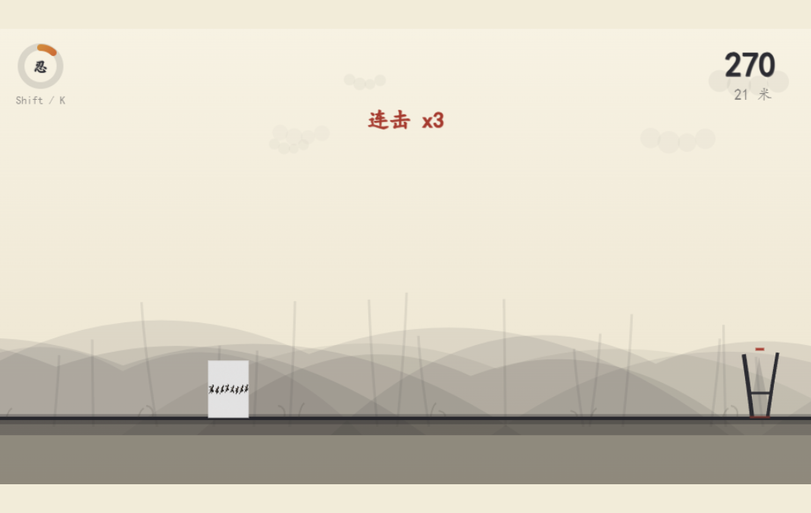

# 水墨忍者 · 横板跑酷（ink-ninja-run）

纯 Canvas 2D 绘制的水墨风横板跑酷。忍者奔跑、跳跃、滑铲，穿越竹林、村庄与夜山，
躲避障碍、收集符印，冲刺更远的距离。



## 玩法

自动向前奔跑，速度随距离逐渐加快。核心循环是「跑 — 跳 — 滑」三种身法躲避迎面而来的障碍，
只有**深坑坠落**会一击即死，其余障碍按血条硬扛。

### 操作

| 按键 | 动作 |
|------|------|
| 空格 / ↑ / W | 跳跃；空中再按一次 = 二段跳 |
| ↓ / S | 地面滑铲（前移冲刺，可穿过垂板空隙）；滑铲后接跳可跳得更远 |
| 空中按 ↓ | 中断起跳、加速砸落 |
| 空中连按两次 ↓ | 俯冲滑铲 |
| Shift / K | 忍术（能量攒满后释放，清屏冲击波） |
| R | 重开 |
| P / Esc | 暂停 |
| F7 | 调试模式（显示碰撞盒） |

### 机制

- **二段跳 / 土狼时间 / 跳跃缓冲**：离地瞬间仍可起跳，落地前按键自动起跳，手感宽松
- **滑铲前移**：滑铲时角色相对画面前移并加速，结束后自动回位；滑铲接跳继承前移形成跳距增益
- **血条**：满血 50，受伤扣除对应伤害，每秒自然恢复；受伤才显示血条，回满淡出
- **深坑即死**：唯一无视血条与护盾的机关，掉到坑底才会死，坠落过程可见
- **忍术能量**：收集金币 / 卷轴积攒，满 100 释放墨色冲击波清屏并加分
- **连击计分**：连续收集金币触发 x2 ~ x5 倍分，3 秒不收集断连
- **护盾符印**：拾取后 10 秒内免疫普通障碍伤害（挡不住深坑）

## 场景区域

跑过指定距离自动切换区域，伴随泼墨过渡动画：

| 区域 | 距离 | 氛围 |
|------|------|------|
| 翠竹林 | 0 ~ 3000 米 | 晨雾竹林，远山 + 青竹 |
| 黄昏村 | 3000 ~ 7000 米 | 日暮村落，灯笼 + 屋顶剪影 + 炊烟 |
| 夜冥山 | 7000 米以上 | 夜雾山岭，枯树 + 鬼火 + 飘雾 |

## 障碍与收集

### 障碍

| 障碍 | 应对 | 伤害 |
|------|------|------|
| 尖刺 / 地刺阵 | 跳跃越过 | 轻伤 12 |
| 石柱 | 跳跃越过 | 撞伤 20 |
| 垂板 | 滑铲钻过空隙（实体墙，撞墙不掉血） | — |
| 剑忍 | 贴地近战，跳跃越过 | 最疼 30 |
| 飞镖潮 | 迎面飞来，低轨跳 / 高轨滑铲 | 轻伤 12 |
| 滚石 | 贴地迎面滚来，跳跃越过 | 轻伤 12 |

### 收集物

| 收集物 | 效果 |
|--------|------|
| 金币（金色菱形符印） | +10 分（连击倍率）、+1 忍术能量 |
| 红卷轴 | +30 分、+30 忍术能量（高空奖励） |
| 护盾符印 | 10 秒护盾 |

## 技术实现

- **Vite 6 + 原生 Canvas 2D**，ES Modules，零运行时依赖
- 所有美术（角色姿势、障碍、粒子、场景装饰）均为**程序化水墨绘制**，无需图片素材
- 状态收敛到单一 `G` 单例（`src/state.js`），逻辑与渲染分层
- 区域、障碍、生成模板均可配置化扩展

### 目录结构

```
src/
  main.js        入口与主循环
  engine.js      帧更新编排
  physics.js     速度曲线 / 重力 / 碰撞 / 收集
  player.js      跳跃 / 滑铲 / 忍术
  generator.js   事件模板轮换与障碍/金币生成
  zone.js        区域枚举与切换
  decor.js       远处装饰元素生成
  particles.js   水墨粒子
  ninjutsu.js    忍术冲击波
  render/        全部绘制（背景 / 实体 / HUD / 忍术 / 文字）
  state.js       共享可变状态单例
  constants.js   全部数值常量
tests/           node --test 单元测试
```

## 运行与构建

```bash
npm install
npm run dev       # 开发服务器
npm run build     # 产物输出到 dist/
npm run preview   # 预览构建产物
```

## 测试

```bash
node --test tests/continuous-slide.test.js tests/dart-wave.test.js tests/hp-system.test.js
```

33 个测试覆盖滑铲连击、飞镖波形、血条/护盾/忍术等核心机制。

## 打包参赛

小红书 vibe coding 参赛作品（截止 2026-09-07），产物为单 ZIP：
`npm run build` 后打包 `index.html` 与 `dist/` 静态资源，体积需 < 10MB（当前约几十 KB）。
